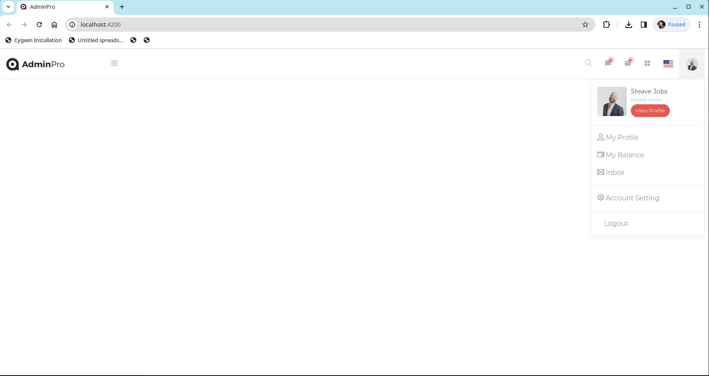
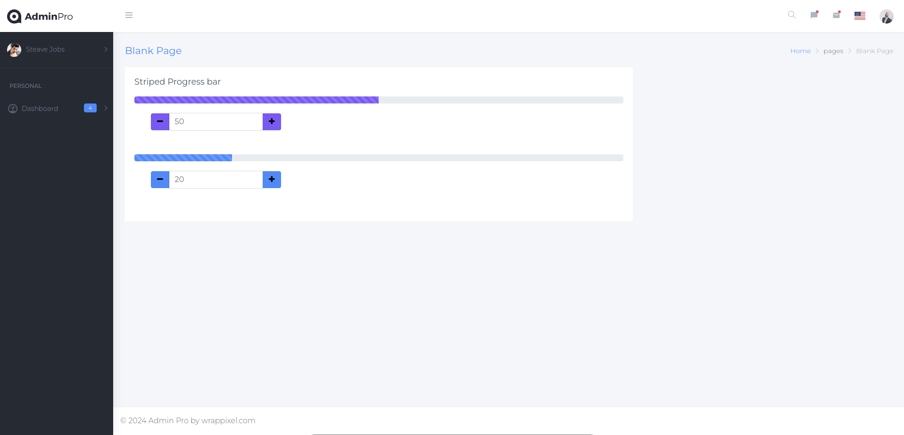
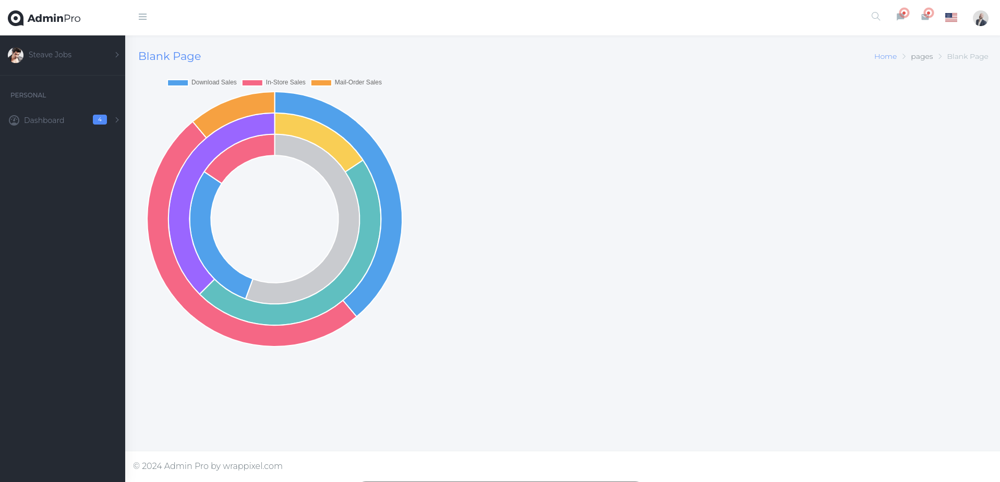
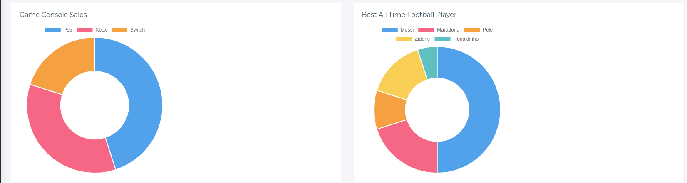
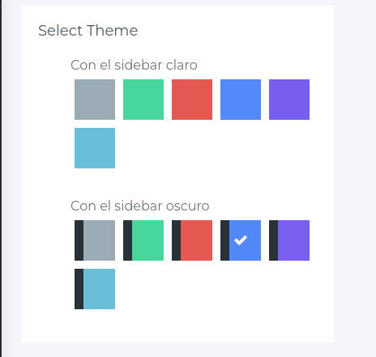

<head>
  <link rel="stylesheet" href="md.css">
</head>


# Curso Avanzado de Angular

<strong>
Plataforma: Udemy   |Instructor: Fernando Herrera |Fecha: Marzo 2023
</strong>


<br/><br/>
## Nota del Autor:

El siguiente documento constituye una exhaustiva recopilación de los conocimientos y prácticas derivados del curso de Angular ofrecido en la plataforma Udemy. Su propósito fundamental radica en servir como un recurso detallado y de fácil acceso para futuras referencias en mi trayectoria profesional.

Además de presentar el código proporcionado por el instructor, este documento incluye explicaciones detalladas de ciertos conceptos que, aunque se abordaron en el curso de Angular, no fueron explorados en profundidad. Se ha procurado enriquecer la comprensión de estos temas mediante análisis más detallados. Esta extensión va más allá de la enseñanza estándar del curso, proporcionando una perspectiva más completa y facilitando la asimilación de conceptos clave. Así, este material no solo actúa como una recopilación de lo aprendido, sino también como un recurso complementario que busca ofrecer una comprensión más holística de los temas tratados en el curso.

Quisiera enfatizar que este material no tiene como finalidad generar lucro alguno. En lugar de ello, busca únicamente consolidar y mantener frescos los conocimientos adquiridos durante el curso. Es importante señalar que la mayor parte del código presente en este documento ha sido proporcionado por el instructor, **Fernando Herrera**. Solo en casos excepcionales se han incorporado modificaciones o funcionalidades adicionales como resultado de prácticas complementarias.

Esta recopilación se presenta como una herramienta personal, creada con el objetivo de fortalecer y consolidar los conceptos aprendidos en el curso de Angular. Agradezco profundamente al instructor por compartir su experiencia y conocimientos, los cuales han sido fundamentales para mi desarrollo en esta tecnología.

Espero que este documento no solo sirva como recordatorio para mí, sino también como una fuente de conocimiento para otros estudiantes interesados en profundizar en Angular. Cabe destacar que cualquier beneficio derivado de este material debe ser atribuido principalmente al esfuerzo y dedicación del instructor y la plataforma Udemy, a quienes agradezco por facilitar este valioso aprendizaje.

[Mas información Aquí: https://www.udemy.com/course/angular-avanzado-fernando-herrera/](https://www.udemy.com/course/angular-avanzado-fernando-herrera/)


__06/Marzo 2024 - ... __


<div style="page-break-after: always;"></div>

## C O N T E N I D O
<hr/>


<div style="page-break-after: always;"></div>

## Instalación

Se requieren las mismas herramientas instaladas en el curso Básico [Vew guía de Instalación](https://github.com/macfredd/udemy-angular/blob/master/00-Curse-Book/Angular-Curso.md#instalaci%C3%B3n)

<div style="page-break-after: always;"></div>

## Angular Cli Tests


Durante la participación en este curso (Marzo 2024) esta es la versión del Angular Cli / Node y Angular.

```bash
[fcruz@fedora 01-clitest]$ ng version

     _                      _                 ____ _     ___
    / \   _ __   __ _ _   _| | __ _ _ __     / ___| |   |_ _|
   / △ \ | '_ \ / _` | | | | |/ _` | '__|   | |   | |    | |
  / ___ \| | | | (_| | |_| | | (_| | |      | |___| |___ | |
 /_/   \_\_| |_|\__, |\__,_|_|\__,_|_|       \____|_____|___|
                |___/
    

Angular CLI: 17.2.3
Node: 20.10.0
Package Manager: npm 10.2.3
OS: linux x64

Angular: 17.2.4
... animations, common, compiler, compiler-cli, core, forms
... platform-browser, platform-browser-dynamic, router

Package                         Version
---------------------------------------------------------
@angular-devkit/architect       0.1702.3
@angular-devkit/build-angular   17.2.3
@angular-devkit/core            17.2.3
@angular-devkit/schematics      17.2.3
@angular/cli                    17.2.3
@schematics/angular             17.2.3
rxjs                            7.8.1
typescript                      5.2.2
zone.js                         0.14.4
```


## Comando help:

**--help** podemos usarlo de forma global `ng --help` o sobre un comando específico, por ejemplo podemos obtener ayuda para el comando que genera un componente:

```bash
$ ng g c --help
ng g component [name]

Creates a new, generic component definition in the given project.

Arguments:
  name  The name of the component.                                                                                                                                                                                                   [string]

Options:
     -c, --change-detection    The change detection strategy to use in the new component.                                                                                           
     
     [string] [choices: "Default", "OnPush"] [default: "Default"]
  ```

NOTA: se mostrará todas las opciones, en este caso a manera de ejemplo mostramos el parámetro **-c** para especificar la estrategia de detección de cambios.

A continuación se muestran las opciones completas para la versión del ***cli 17.2.3***

|Option|Desc|Values|
|-|-|-|
|--help|Shows a help message for this command in the console.|[boolean]|
|--interactive|Enable interactive inputprompts.|[boolean] [default: true]|
|-d, --dry-run|Run through and reports activity without writing out results.|[boolean] [default: false]|
|--defaults|Disable interactive input prompts for options with a default.|[boolean] [default: false]|
|--force|Force overwriting of existing files.|[boolean] [default: false]|
|-c, --change-detection|The change detection strategy to use in the new component. |[string] [choices: "Default", "OnPush"] [default: "Default"]|
|-b, --display-block|Specifies if the style will contain `:host { display: block; }`.|[boolean] [default: false]|
--export|The declaring NgModule exports this component.|[boolean] [default: false]|
|--flat|Create the new files at the top level of the current project.|[boolean] [default: false]|
|-s, --inline-style|Include styles inline in the component.ts file. Only CSS styles can be included inline. By default, an external styles file is created and referenced in the component.ts file.|        [boolean] [default: false]|
|-t, --inline-template|Include template inline in the component.ts file. By default, an external template file is created and referenced in the component.ts file.|                                            [boolean] [default: false]|
|-m, --module|The declaring NgModule.|[string]|
|-p, --prefix|The prefix to apply to the generated component selector.|[string]|
|--project|The name of the project.|[string]|
|--selector|The HTML selector to use for this component.|[string]|
|--skip-import|Do not import this component into the owning NgModule.|[boolean] [default: false]|
|--skip-selector|Specifies if the component should have a selector or not.|[boolean] [default: false]|
|--skip-tests|Do not create "spec.ts" test files for the new component.|[boolean] [default: false]|
|--standalone|Whether the generated component is standalone.|[boolean] [default: true]|
|--style|The file extension or preprocessor to use for style files, or 'none' to skip generating the style file.|[string] [choices: "css", "scss", "sass", "less", "none"] [default: "css"]|
|--type|Adds a developer-defined type to the filename, in the format "name.type.ts".|[string] [default: "Component"]|
|-v, --view-encapsulation|The view encapsulation strategy to use in the new component.| [string] [choices: "Emulated", "None", "ShadowDom"]|


## Primera APP

```bash
$ ng new 01-clitest --standalone false
```

<aside class="nota-informativa">
<p> Vamos a usar la forma anterior basada en módulo. Esto lo hacemos con la opción <strong>--standalone false</strong></p>
</aside>

## Comandos básicos del Ng Cli.

Podemos usar la opción **-d** la cual nos permite probar varios opciones sin aplicar cambios en el proyecto, por ejemplo: Creemos un componente home con y sin el flag  **--flat**

### Agregar componente
```bash
$ ng g c home -d
CREATE src/app/home/home.component.css (0 bytes)
CREATE src/app/home/home.component.html (19 bytes)
CREATE src/app/home/home.component.spec.ts (587 bytes)
CREATE src/app/home/home.component.ts (191 bytes)
UPDATE src/app/app.module.ts (467 bytes)
```

Crea el Componente en su propio directorio ./src/app/home, ahora usemos el --flat.

```bash
$ ng g c home -d --flat
CREATE src/app/home.component.css (0 bytes)
CREATE src/app/home.component.html (19 bytes)
CREATE src/app/home.component.spec.ts (587 bytes)
CREATE src/app/home.component.ts (191 bytes)
UPDATE src/app/app.module.ts (462 bytes)
```

Crea el componente en la ruta ./src/app

Coloquemos el Inline CSS **-s, --inline-style** y Inline Template **-t, --inline-template**

```bash
$ ng g c home -d --flat -s -t
CREATE src/app/home.component.spec.ts (587 bytes)
CREATE src/app/home.component.ts (183 bytes)
UPDATE src/app/app.module.ts (462 bytes)
```

Finalmente creemos el componente sin los archivos de prueba con la opción **--skip-tests**

```bash
$ ng g c home -d --flat -s -t --skip-tests
CREATE src/app/home.component.ts (183 bytes)
UPDATE src/app/app.module.ts (462 bytes)
```

Ejecutamos este último comando sin el -d para aplicar los cambios:

```bash
$ ng g c home --flat -s -t --skip-tests
CREATE src/app/home.component.ts (183 bytes)
UPDATE src/app/app.module.ts (462 bytes)
```

El componente creado es el siguiente:

```typescript
import { Component } from '@angular/core';

@Component({
  selector: 'app-home',
  template: `
    <p>
      home works!
    </p>
  `,
  styles: ``
})
export class HomeComponent {

}
```

Adicionalmente, Ng Cli actualiza el **AppModule** y declara el nuevo componente. Pero, esto no lo hace visible al mundo exterior (fuera del componente) simplemente lo declara dentro del mismo módulo para su uso interno.

```bash
$ tree
.
├── app.component.css
├── app.component.html
├── app.component.spec.ts
├── app.component.ts
├── app.module.ts
├── app-routing.module.ts
└── home.component.ts  <=====
```

## Opciones del NG Generate

|Comando| Descripcion|
|-|-|
|ng g app-shell|Generates an application shell for running a server-side version of an app.|
|ng g application [name]|Generates a new basic application definition in the "projects" subfolder of the workspace.|
|ng g class [name]|Creates a new, generic class definition in the given project.|
|ng g component [name]|Creates a new, generic component definition in the given project.|
|ng g config [type]|Generates a configuration file in the given project.
|ng g directive [name]|Creates a new, generic directive definition in the given project.|
|ng g enum [name]|Generates a new, generic enum definition in the given project.|
|ng g environments|Generates and configures environment files for a project.|
|ng g guard [name]|Generates a new, generic route guard definition in the given project.|
|ng g interceptor [name]|Creates a new, generic interceptor definition in the given project.|
|ng g interface [name] [type]|Creates a new, generic interface definition in the given project.|
|ng g library [name]|Creates a new, generic library project in the current workspace.|
|ng g module [name]|Creates a new, generic NgModule definition in the given project.|
|ng g pipe [name]|Creates a new, generic pipe definition in the given project.|
|ng g resolver [name]|Generates a new, generic resolver definition in the given project.|
|ng g service [name]|Creates a new, generic service definition in the given project.|
|ng g service-worker |Pass this schematic to the "run" command to create a service worker
|ng g web-worker [name]|Creates a new, generic web worker definition in the given project.


<div style="page-break-after: always;"></div>

# Nueva Sección: Nueva Aplicación:

## ¿Qué veremos en esta sección?

En esta sección trabajaremos sobre:

- Uso del template administrativo
- Código fuente del template
- Uso de librerías externas
- Creación de los primeros componentes
- Separar el Login del template administrativo, ya que tienen estructuras diferentes
- Animaciones por CSS
- Respaldos en GitHub
- Preparar el proyecto que usaremos a lo largo del curso


## Creando COmponentes y Estructura de Directorios

```bash
#Auth
$ ng g  c auth/login         --skip-tests -s
$ ng g  c auth/register      --skip-tests -s
#Pages
$ ng g  c pages/nopagefound  --skip-tests -s
$ ng g  c pages/dashboard    --skip-tests -s

$ ng g  c shared/breadcrumbs --skip-tests -s
$ ng g  c shared/side-bar    --skip-tests -s
$ ng g  c shared/header      --skip-tests -s

```

## Importanto Plantilla existente

Usaremos una plantilla previamente diseñada, la cual contiene todas las dependeicnas, tales como imágenes, estilos, plugins, librerias de terceros, etc.

Copiaremos a nuestra carpeta **Assets** todos esos elementos y modificaremos nuestro index.html para incluir dichos elementos en nuestra página.


```html
<!doctype html>
<html lang="en">
<head>
  <meta charset="utf-8">
  <title>AdminPro</title>
  <meta name="viewport" content="width=device-width, initial-scale=1">
  <link rel="icon" type="image/png" sizes="16x16" href="./assets/images/favicon.png">

  <!-- Bootstrap Core CSS -->
  <link href="./assets/plugins/bootstrap/css/bootstrap.min.css" rel="stylesheet">
  <!-- Custom CSS -->
  <link href="./assets/css/style.css" rel="stylesheet">
  <!-- You can change the theme colors from here -->
  <link href="./assets/css/colors/default-dark.css" id="theme" rel="stylesheet">


</head>
<body class="fix-header card-no-border fix-sidebar">
  <app-root></app-root>

   <!-- ============================================================== -->
    <!-- All Jquery -->
    <!-- ============================================================== -->
    <script src="./assets/plugins/jquery/jquery.min.js"></script>
    <!-- Bootstrap tether Core JavaScript -->
    <script src="./assets/plugins/bootstrap/js/popper.min.js"></script>
    <script src="./assets/plugins/bootstrap/js/bootstrap.min.js"></script>
    <!-- slimscrollbar scrollbar JavaScript -->
    <script src="./assets/js/perfect-scrollbar.jquery.min.js"></script>
    <!--Wave Effects -->
    <script src="./assets/js/waves.js"></script>
    <!--Menu sidebar -->
    <script src="./assets/js/sidebarmenu.js"></script>
    <!--stickey kit -->
    <script src="./assets/plugins/sticky-kit-master/dist/sticky-kit.min.js"></script>
    <script src="./assets/plugins/sparkline/jquery.sparkline.min.js"></script>
    <!--Custom JavaScript -->
    <script src="./assets/js/custom.min.js"></script>
    <!-- ============================================================== -->
    <!-- Style switcher -->
    <!-- ============================================================== -->
    <script src="./assets/plugins/styleswitcher/jQuery.style.switcher.js"></script>
</body>
</html>
```

El proceso para incorporar una plantilla consiste en tomar cada parte y colocarla en el lugar adecuado, tal como si comenzó con el index.html. 


La siguiente sección la dejaremos en el index.html, muestra una animación durante la carga de la página.

```html
<!-- ============================================================== -->
<!-- Preloader - style you can find in spinners.css -->
<!-- ============================================================== -->
<div class="preloader">
    <div class="loader">
        <div class="loader__figure"></div>
        <p class="loader__label">Admin Pro</p>
    </div>
</div>
```

Posteriormente sigue la sección del header. El HTML d esa sección la colocaremos en el componente **HeaderComponent**

```html
<!-- ============================================================== -->
<!-- Topbar header - style you can find in pages.scss -->
<!-- ============================================================== -->
<header class="topbar">
  <!-- Copiamos toda la sección del header -->
</header>
```

Ahora podemos agregar el **main-wrapper** y el componente Header en el template del **AppComponent** 

```html
<div id="main-wrapper">
  <app-header></app-header>
</div>
```




Moveremos toda la sección del **Left Sidebar** a nuestro SideBarComponent.

```html
<!-- ============================================================== -->
<!-- Left Sidebar - style you can find in sidebar.scss  -->
<!-- ============================================================== -->
  <aside class="left-sidebar"></aside>
````

Y luego lo agregamos a nuestro AppComponent:

```html
<div id="main-wrapper">
  <app-header></app-header>
  <app-side-bar></app-side-bar>
</div>
```

Luego copiaremos algunas secciones directamentene en nuestro template principal, porque ellas mostraran internamente todas nuestras rutas


```html
<div id="main-wrapper">
  <app-header></app-header>
  <app-side-bar></app-side-bar>

  <div class="page-wrapper">
    <div class="container-fluid">
      <!-- Sistema de Rutas -->
    </div>
  </div>
</div>
```

La siguiente sección que debemos de mover es la **Bread crumb** y lo hacemos a nuestro componente **BreadcrumbsComponent** Y movemos el footer directamente al template principal. No usaremos el Rigth Side Bar. El template principal queda así:

```html
<div id="main-wrapper">
  <app-header></app-header>
  <app-side-bar></app-side-bar>

  <div class="page-wrapper">
    <div class="container-fluid">
      <app-breadcrumbs></app-breadcrumbs>

      <!-- Sistema de Rutas -->


      <!-- ============================================================== -->
      <!-- Start Page Content -->
      <!-- ============================================================== -->
      <div class="row">
        <div class="col-12">
            <div class="card">
                <div class="card-body">
                    This is some text within a card block.
                </div>
            </div>
        </div>
      </div>
      <!-- ============================================================== -->
      <!-- End PAge Content -->
      <!-- ============================================================== -->
    </div>
    <!-- ============================================================== -->
    <!-- footer -->
    <!-- ============================================================== -->
    <footer class="footer">
      © 2024 Admin Pro by wrappixel.com
    </footer>
    <!-- ============================================================== -->
    <!-- End footer -->
    <!-- ============================================================== -->
  </div>
</div>
```

## Rutas Principales
Creamos un par de componentes más: 
```bash
$ ng g c pages/progress -s --skip-tests
$ ng g c pages/grafica1 -s --skip-tests
```

Y luego definimos las rutas principales

```typescript
const routes: Routes = [
  { path: 'dashboard', component: DashboardComponent },
  { path: 'login', component: LoginComponent },
  { path: 'register', component: RegisterComponent },
  { path: 'progress', component: ProgressComponent },
  { path: 'grafica1', component: Grafica1Component },
  { path: '', redirectTo: '/dashboard', pathMatch: 'full' },
  { path: '**', component: NopagefoundComponent }
];

@NgModule({
  imports: [RouterModule.forRoot(routes)],
  exports: [RouterModule]
})
export class AppRoutingModule { }
```

Finalmente implementamos nuestro **router-outlet** en el AppComponent para mostrar cada uno de los componentes dentro del contenedor **container-fluid**

## Rutas Secundarias

En este momento todos los componente, incluyendo el Login y Register se muestran como un componente más dentro del Dashboard. El Dashboard debe de mostrarse únicamente si el usuario está logeado.

La idea es crear un componente que muestre todo el Layout actual, el dashdoard con sus componentes, para ello vamos a mover todo el código HTML del AppComponent a un nuevo componente:

```bash
$ ng g c pages/pages -s --skip-tests --flat 
```

Este componente se va a mostrar únicamente cuando el usuario esté logeado. 

Haremos estos cambios en nuestro sistema de Rutas:

```typescript
const routes: Routes = [

  {
    path: '',
    component: PagesComponent,
    children: [
      { path: 'dashboard', component: DashboardComponent },
      { path: 'progress', component: ProgressComponent },
      { path: 'grafica1', component: Grafica1Component },
      { path: '', redirectTo: '/dashboard', pathMatch: 'full' },
    ],
  },
  { path: 'login', component: LoginComponent },
  { path: 'register', component: RegisterComponent },
  { path: '**', component: NopagefoundComponent }
  
];
```

Aca lo que estamos indicando es que login y register van a renderizarse fuera del componente Pages, que es el que renderiza el template con los headers, sideBar, etc. 

De esta forma tenemos las rutas de login y register independientes y podemos implementar su propio template.

## Separando Login y Register del Template

Usaremos como plantilla el archivo **Pages-login-2.html** y **Pages-register2.html**, copiaremos la sección **<section id="wrapper">** y lo colocaremos en su correspondiente template (login & register)


Ambos template tienen su propio CSS
```html
<link href="css/pages/login-register-lock.css" rel="stylesheet">
<link href="css/pages/login-register-lock.css" rel="stylesheet">
```
Copiaremos el contenido del Css y lo moveremos al correspondiente CSS file del componente.

Haremos un trabajo similar con la Página 404.

Este proceso lo podemos repetir para incorporar parte de la plantilla a nuestra app de Angular.


<div style="page-break-after: always;"></div>

# Nueva Sección: Módulos:

## ¿Qué veremos en esta sección?

Esta sección esta enfocada en módulos principalmente:

 - Crear un módulo personalizado
 - Crear rutas hijas
 - Comenzaremos a crear módulos para agrupar tareas específicas
 - Realizar cambios en GitHub
 - Crear Release Tags que nos permitan descargar el código fácilmente, en caso de que necesitemos volver a comenzar donde nos quedemos.


Ahora mismo nuestro AppModule luce de la siguiente forma:

```typescript
@NgModule({
  declarations: [
    AppComponent,
    // Agregarlo a un módulo Auth
    LoginComponent,
    RegisterComponent,
    // Agregarlo a un módulo Shared
    BreadcrumbsComponent,
    SideBarComponent,
    HeaderComponent,
    // Agrupar en un Módulo Pages
    DashboardComponent,
    ProgressComponent,
    Grafica1Component,
    PagesComponent,
    NopagefoundComponent,
  ],
  imports: [
    BrowserModule,
    AppRoutingModule
  ],
  providers: [],
  bootstrap: [AppComponent]
})
export class AppModule { }
```

Como podemos ver, todos los componentes han sido declarados en el módulo principal, en un futuro, esto puede represenar un problema. A medida que crece nuestra APP, vamos a incorporar más componentes. Lo ideal es separar en módulos que agrupen componentes específicos.

La idea es crear módulos para cada uno de nuestros directorios principales, en este caso Auth, Pages y Shared

```bash
├── auth
│   ├── login
│   └── register
├── pages
│   ├── dashboard
│   ├── grafica1
│   ├── nopagefound
│   ├── pages.component.html
│   ├── pages.component.ts
│   └── progress
└── shared
    ├── breadcrumbs
    ├── header
    └── side-bar
```

Notar que **pages.component.ts** se creó con --flat dentro del direcotrio principal de pages.

Creamos tres módulos

```bash
$ ng g m auth
CREATE src/app/auth/auth.module.ts (190 bytes)

$ ng g m pages
CREATE src/app/pages/pages.module.ts (191 bytes)

$ ng g m shared
CREATE src/app/shared/shared.module.ts (192 bytes)

```

Movemos a cada módulo sus componentes:


Auth:

```typescript
@NgModule({
  declarations: [
    LoginComponent,
    RegisterComponent,
  ],
  imports: [
    CommonModule
  ],
  exports: [
    LoginComponent,
    RegisterComponent,
  ]
})
export class AuthModule { }
```

Pages:

```typescript
@NgModule({
  declarations: [
    DashboardComponent,
    Grafica1Component,
    ProgressComponent,
    PagesComponent
  ],
  exports: [
    DashboardComponent,
    Grafica1Component,
    ProgressComponent,
    PagesComponent,
  ],
  imports: [
    CommonModule,
    AppRoutingModule, /* or RouterModule*/
    SharedModule
  ]
})
export class PagesModule { }
```

NOTA: En lugar del **AppRoutingModule** podemos usar el **RouterModule** ya que solo necesitamos el **router-outlet** para mostrar la páginas según la ruta en nuestra **pages.component.html** 

Angular ya ha cargado globalmente nuestro **AppRoutingModule** con nuestrar reglas de ruteo.


Shared:

```typescript
@NgModule({
  declarations: [
    BreadcrumbsComponent,
    SideBarComponent,
    HeaderComponent,
  ],
  exports: [
    BreadcrumbsComponent,
    SideBarComponent,
    HeaderComponent,
  ],
  imports: [
    CommonModule
  ]
})
export class SharedModule { }
```

Y nuestro AppModule quedará de la siguiente forma:


```typescript
@NgModule({
  declarations: [
    AppComponent,
    NopagefoundComponent,
  ],
  imports: [
    BrowserModule,
    AppRoutingModule,
    PagesModule,
  ],
  providers: [],
  bootstrap: [AppComponent]
})
export class AppModule { }
```

Hemos dejado **NopagefoundComponent** porque es un componente que debe de mostrarse independientemente el usuario esté logeado o no. De hecho lo vamos a mover a la raiz del proyecto:

```bash
src/app/
├── auth
├── nopagefound
│   ├── nopagefound.component.css
│   ├── nopagefound.component.html
│   └── nopagefound.component.ts
├── pages
│   ├── dashboard
│   ├── grafica1
│   └── progress
└── shared
```


## Reorganizando rutas:

Otro tipo de mejora o buena práctica consiste en evitar que el **AppRoutingModule** cargue todas las rutas, lo ideal es que cada sección o módulo que pueda llegar a crecer en número de páginas, tenga su propio sistema de rutas.

Por ejemplo, ahora mismo el **AppRoutingModule** maneja todas las rutas, y como se puede ver el 


```typescript
const routes: Routes = [

  {
    path: '',
    component: PagesComponent,
    children: [
      { path: 'dashboard', component: DashboardComponent },
      { path: 'progress', component: ProgressComponent },
      { path: 'grafica1', component: Grafica1Component },
      { path: '', redirectTo: '/dashboard', pathMatch: 'full' },
    ],
  },
  { path: 'login', component: LoginComponent },
  { path: 'register', component: RegisterComponent },
  { path: '**', component: NopagefoundComponent }
];
```

Creamo un nuevo archivo dentro de __src/app/pages__ con el nombre **pages-routing.module.ts** y usamos los snippest de angular para crear un template del routing, **ng-router** y movemos todas las rutas que apuntan a paginas dentro de **pages** quedando de esta forma:

```typescript
onst routes: Routes = [
    {
        path: '',
        component: PagesComponent,
        children: [
          { path: 'dashboard', component: DashboardComponent },
          { path: 'progress', component: ProgressComponent },
          { path: 'grafica1', component: Grafica1Component },
          { path: '', redirectTo: '/dashboard', pathMatch: 'full' },
        ],
      },
];

@NgModule({
    imports: [RouterModule.forChild(routes)],
    exports: [RouterModule]
})
export class PagesRoutingModule {}
```

Y nuestro sistema de rutas principal se reduce a:

```typescript
const routes: Routes = [
  { path: 'login', component: LoginComponent },
  { path: 'register', component: RegisterComponent },
  { path: '**', component: NopagefoundComponent }
];

@NgModule({
  imports: [
    RouterModule.forRoot(routes),
    PagesRoutingModule,
  ],
  exports: [RouterModule]
})
export class AppRoutingModule { }
```

Notar como hemos importado el **PagesRoutingModule** en la sección de Imports.

## Mejorar la Navegación

Actualmente tenemos estos  URL

http://localhost:4200/dashboard
http://localhost:4200/progress
http://localhost:4200/grafica1


```typescript
const routes: Routes = [
    {
        path: '',
        component: PagesComponent,
        children: [
          { path: 'dashboard', component: DashboardComponent },
          { path: 'progress', component: ProgressComponent },
          { path: 'grafica1', component: Grafica1Component },
          { path: '', redirectTo: '/dashboard', pathMatch: 'full' },
        ],
      },
];
```
Para cargar los componentes progress y grafica1 dentro del Dashboard, tal como se muestran en los siguientes URL: 

http://localhost:4200/dashboard
http://localhost:4200/dashboard/progress
http://localhost:4200/dashboard/grafica1

Debemos aplicar estos cambios.

```typescript
const routes: Routes = [
    {
        path: 'dashboard',
        component: PagesComponent,
        children: [
          { path: '', component: DashboardComponent },
          { path: 'progress', component: ProgressComponent },
          { path: 'grafica1', component: Grafica1Component },
        ],
      },
];
```

<div style="page-break-after: always;"></div>

# Nueva Sección: Inputs y Outputs:

## ¿Qué veremos en esta sección?

sta sección esta dedicada a los componentes y el envío de información entre ellos.

- Trabajaremos con Outputs, Inputs y ViewChild
- Aprenderemos como utilizar atributos personalizados
- Crearemos un componente re utilizable con una funcionalidad en especifico
- Aprenderemos a tener referencias a elementos HTML
- Tips de JavaScript puro: colocar el foco en elementos
- Uso de gráficas como componentes personalizados

<aside class="nota-importante">
<p>
  Los temas Outputs, Inputs y ViewChild se vieron en el curso básico.
</p>
</aside>



## Gráficos en Angular

Instalamos estas dos librerias:

```bash
$ npm install --save ng2-charts
$ npm install --save chart.js
```


### Configuración global:

En el App.Module importamos:

```typescript
import { provideCharts, withDefaultRegisterables } from 'ng2-charts';
```

Y luego en la sección de Providers del mismo AppModule:

```typescript
providers: [
   provideCharts(withDefaultRegisterables()),
],
```

### COnfiguración en el módulo específico

En el PageModule importaremos la libreria, que que el componente Grafica1 está declarado dentre de Pages.

```typescript
import { BaseChartDirective } from 'ng2-charts';

// Luego importamos la directiva

@NgModule({
  declarations: [
  ],
  exports: [
  ],
  imports: [
    BaseChartDirective,
  ]
})
export class PagesModule { }
```

### El Componente:

Este se obtiene de la documentación oficial, a modo de ejemplo:

```typescript

import { Component } from '@angular/core';
import { ChartData, ChartEvent, ChartType } from 'chart.js';

@Component({
  selector: 'app-grafica1',
  templateUrl: './grafica1.component.html',
  styles: ``
})
export class Grafica1Component {
  // Doughnut
  public doughnutChartLabels: string[] = [
    'Download Sales',
    'In-Store Sales',
    'Mail-Order Sales',
  ];
  public doughnutChartData: ChartData<'doughnut'> = {
    labels: this.doughnutChartLabels,
    datasets: [
      { data: [350, 450, 100] },
      { data: [50, 150, 120] },
      { data: [250, 130, 70] },
    ],
  };
  public doughnutChartType: ChartType = 'doughnut';

  // events
  public chartClicked({
    event,
    active,
  }: {
    event: ChartEvent;
    active: object[];
  }): void {
    console.log(event, active);
  }

  public chartHovered({
    event,
    active,
  }: {
    event: ChartEvent;
    active: object[];
  }): void {
    console.log(event, active);
  }
}
```
Y finalmente el Template:

```html
<div class="row">
    <div class="col-4">
        <div style="display: block">
            <canvas baseChart 
                    [data]="doughnutChartData" 
                    [type]="doughnutChartType">
            </canvas>
        </div>
    </div>
</div>
```

El resultado:



## Parametrizar el Componente

Podemos hacer parametrizable ciertos elementos del componente como los labels y los valores:

```typescript
@Input() public title: string = 'Graph Title'
@Input() public dataArray: number[] = [1,20,30];
@Input() public lables: string[] = ['Label 1', 'Label 2', 'Label 3'];
```

Luego debemos implementar el **ngOnInit** para inicializar los valores desde los Inputs:

```typescript
ngOnInit(): void {
    this.doughnutChartData = {
      labels: this.lables,
      datasets: [
        { data : this.dataArray},
      ],
    };
  }
```

Y luego podemos usar el componente en nuestras páginas:

```html
<app-grafica1 
    title="Game Console Sales" 
    [dataArray]="[45, 35, 20]"
    [lables]="['Ps5', 'Xbox', 'Switch']">
</app-grafica1>
<app-grafica1 
    title="Best All Time Football Player" 
    [dataArray]="[50, 20, 10, 15, 5]"
    [lables]="['Messi', 'Maradona', 'Pele', 'Zidane', 'Ronaldinho']">
</app-grafica1>
```





<div style="page-break-after: always;"></div>

# Nueva Sección: Servicios, Rutas y persistencia de ajustes:

## ¿Qué veremos en esta sección?

Esta sección tiene varios temas importantes:

- Crearemos un módulo para agrupar todos nuestros servicios
- Aprenderemos a ejecutar scripts en archivos de JavaScript puros, en TypeScript
- LocalStorage
- Cambiar CSS de forma dinámica
- Crear un componente para los ajustes del tema
- Tips de JavaScript que se pueden usar en TypeScript
- Preparar el servicio del Sidebar, el cual usaremos más adelante para crear nuestro menú dinámico en base a las respuestas de nuestro backend server.


## Nuevo componente:

Account Settings: 

```bash
 $ ng g c pages/settings --skip-tests --s
 ```

 Agregamos este Template:

 ```html
<!-- Card Wrapper-->
<h4>Select Theme</h4>
<div class="r-panel-body">
    <ul id="themecolors" class="m-t-20">
        <li><b>Con el sidebar claro</b></li>
        <li>
          <li><a 
            (click)="changeTheme('default')" 
            data-theme="default" 
            class="selector default-theme">1</a></li>
        </li>
        <!-- Mas temas aca-->
        <li class="d-block m-t-30"><b>Con el sidebar oscuro</b></li>
        <li>
          <a 
            (click)="changeTheme('default-dark')" 
            data-theme="default-dark" 
            class="selector default-dark-theme">7
          </a>
        </li>
        <!-- Mas temas aca-->
    </ul>
</div>
<!-- Card Wrapper-->             

```
Veremos esto:



## Cambiar Tema de forma dinámica

En el inde.html tenemos esto: 
```html
<!-- You can change the theme colors from here -->
<link href="./assets/css/colors/default-dark.css" id="theme" rel="stylesheet">
```

El objetivo es cambiar dinamicamente este link según el tema seleccionado por el usuario:

```typescript
export class SettingsComponent implements OnInit{
  ngOnInit(): void {
    this.checkCurrentTheme();
  }

  // these lines avoid hit the DOM multiple times
  linkTheme?: Element | null = document.querySelector('#theme') ;
  links = document.querySelectorAll('.selector');
  
  changeTheme(theme: string) {
    const themeUrl = `./assets/css/colors/${ theme }.css`;

    if (this.linkTheme === null) {
      const newLinkTheme = document.createElement('link');
      newLinkTheme.setAttribute('id', 'theme');
      newLinkTheme.setAttribute('rel', 'stylesheet');
      newLinkTheme.setAttribute('href', themeUrl);
      document.head.append(newLinkTheme);
    } else {
      this.linkTheme!.setAttribute('href', themeUrl);
    }
    localStorage.setItem('themeUrl', themeUrl);
    this.checkCurrentTheme();

  }

  checkCurrentTheme() {
    this.links.forEach( elem => {
      elem.classList.remove('working');
      const btnTheme = elem.getAttribute('data-theme');
      const btnThemeUrl = `./assets/css/colors/${ btnTheme }.css`;
      const currentTheme = this.linkTheme?.getAttribute('href') || '';

      if (btnThemeUrl === currentTheme) {
        elem.classList.add('working');
      }
    });
  }
}

```

Al guardar en el localStorage el theme seleccionado, ya disponemos de dicha información para establecer el tema al cargar la applicación. Este template usa el tema una vez logeado el usuario, porque el Login y el Register usan su propio estilo. Así que implementaremos esto en el PagesComponent

```typescript
export class PagesComponent implements OnInit {
  ngOnInit(): void {
    const linkTheme = document.querySelector('#theme');
    const themeUrl = localStorage.getItem('themeUrl') || './assets/css/colors/default.css';
    linkTheme?.setAttribute('href', themeUrl);
  }
}
```

De esta forma cuando el usuario selecciona un thema se cambia automáticamente y al recargar la aplicación se usa el último tema seleccionado.


## Setting Services

Vamos a mover las configuraciones que habiamos colocado en **SettingsComponent** a un servicio

```bash
$ ng g s services/settings
```

El componente queda de esta forma:

```typescript
export class SettingsComponent implements OnInit{
  
  constructor(private settingsService: SettingsService) { }

  ngOnInit(): void {
    this.settingsService.checkCurrentTheme();
  }

  // Change the theme
  changeTheme(theme: string) {
    this.settingsService.changeTheme(theme);
  }
}
```

Y el servicio ahora contiene toda la lógica del Setting template:

```typescript
export class SettingsService {

  private linkTheme = document.querySelector('#theme');
  
  constructor() { 
    const themeUrl = localStorage.getItem('themeUrl') || './assets/css/colors/default.css';
    this.linkTheme?.setAttribute('href', themeUrl);
  }

  changeTheme(theme: string) {
    const themeUrl = `./assets/css/colors/${ theme }.css`;

    if (this.linkTheme === null) {
      const newLinkTheme = document.createElement('link');
      newLinkTheme.setAttribute('id', 'theme');
      newLinkTheme.setAttribute('rel', 'stylesheet');
      newLinkTheme.setAttribute('href', themeUrl);
      document.head.append(newLinkTheme);
    } else {
      this.linkTheme!.setAttribute('href', themeUrl);
    }
    localStorage.setItem('themeUrl', themeUrl);
    this.checkCurrentTheme();
  }

  // Check the current theme
  checkCurrentTheme() {
    const links = document.querySelectorAll('.selector');
    links?.forEach( elem => {
      elem.classList.remove('working');
      const btnTheme = elem.getAttribute('data-theme');
      const btnThemeUrl = `./assets/css/colors/${ btnTheme }.css`;
      const currentTheme = this.linkTheme?.getAttribute('href') || '';

      if (btnThemeUrl === currentTheme) {
        elem.classList.add('working');
      }
    });
  }
}
```

## Router Link

Cambiemo el sideBar HTML, vamos a usar nuestro nuevo componente. El link siguiente:
```html
<li><a href="javascript:void()">Account Setting</a></li>
```

Lo cambiamos por:
```html
<li><a routerLink="/dashboard/settings">Account Setting</a></li>
```

Para usar el **routerLink** necesitamos importar el **RouterModule** en el Módulo al que pertenece el SideBar, es decir el **ShareModule**.


## Servicio para controlar el sideBar

La idea es crear las opciones del sideBar de manera dinámica.

```bash
$ ng g s services/sidebar --skip-tests
```

CReamos el servicio

```typescript
export class SidebarService {

  private menu: MenuImtes[] = [
    {
      title: 'Dashboard',
      icon: 'mdi mdi-gauge',
      submenu: [
        { title: 'Dashboard', url: '/dashboard' },
        { title: 'Progress Bar', url: 'progress' },
        { title: 'Gráficas', url: 'graficas' },
      ]
    }
  ];

  constructor() { }

  getMenu(): MenuImtes[] {
    return this.menu;
  }
}
```

Y usamos el menú en nuestro template

```typescript
@for (item of menu; track $index) {
    <li> 
        <a class="has-arrow waves-effect waves-dark" href="#" aria-expanded="false">
            <i class="mdi mdi-gauge"></i>
            <span class="hide-menu">{{ item.title }}
                <span 
                    class="label label-rouded label-themecolor pull-right">
                    {{ item.submenu.length }}
                </span>
            </span>
        </a>
        <ul aria-expanded="false" class="collapse">
            @for (item of item.submenu; track $index) {
                <li><a routerLink="{{ item.url }}">{{ item.title }}</a></li>
            }
        </ul>
    </li>
}
```

## Login Logout y un error de JS

Implementemos el Logout, por ahora solo es la navegación

```html
<li><a routerLink="/login"><i class="fa fa-power-off"></i> Logout</a></li>
```

En el Login debemos hacer un par de cosas. Perimero eliminaremos el **Action** y luego agregamos el **submit** de angular

```html
<form class="form-horizontal form-material" 
      id="loginform"
      (submit)="submitLoginForm()">
```

Deginimos el **submitLoginForm**

```typescript
export class LoginComponent {

  constructor(private router: Router) { }

  submitLoginForm() {
    this.router.navigateByUrl('/dashboard');
  }
}
```
NOTA: Debemos importar el **RouterModule** y **FormsModule**, este último permite a Angular manejar el Submit. 

```typescript
@NgModule({
  declarations: [],
  imports: [
    CommonModule,
    RouterModule,
    FormsModule,
  ],
  exports: []
})
export class AuthModule { }
```

Si navegamos desde Inicio de sesión hasta Panel de control, Angular destruye todo y lo reconstruye nuevamente, hay un custom.js, que inicializa todos los complementos de la plantilla. Esto sólo se llama cuando la página se carga por primera vez. El problema es que cuando recargamos la página después de iniciar sesión, los complementos no se inicializan y muchos enlaces no tienen adjunto el evento requerido, lo que hace que la página se recargue cuando hacemos clic sobre ellos. Al recargar la página los plugins se inicializan correctamente y funcionan bien.

Haremos un cambio en este archivo:

```html
<script src="./assets/js/custom.min.js"></script>
```

Cambiemos el **custom.min.js** por el **custom.js** y editemos su contenido.

Todo el contenido del **custom.js** lo vamos a incluir dentro de esta función:

```js
const customInitFunction = () => {
  // all custom.js content goes here!!!
}
// We call the new function at the end of the file
customInitFunction();
```

La idea es encapsular la inicialización de todos los plugins dentro de una función global que pueda llamarse cuando Angular reconstruye nuestro componente principal.

Finalmente usaremos esta función en el PagesComponent, el cual es el Wrapper principal de todos nuestros componentes del Template que usamos

```typescript
declare function customInitFunction() : void;

@Component({
  selector: 'app-pages',
  templateUrl: './pages.component.html',
  styles: ``
})
export class PagesComponent implements OnInit{

constructor(private settingsService: SettingsService) { }
  ngOnInit(): void {
    customInitFunction();
  }
}
```

La instrucción `declare function customInitFunction() : void;` le indica a Typescript que tenemos una fn gobal **customInitFunction** definida en alguna parte y que podemos usarla.

De esta forma, al hacer el login, al momento que Angular crea nuevamente el PagesComponent, inicializa todos los plugins del Template.


<div style="page-break-after: always;"></div>

# Nueva Sección: Observables y Promesas

## ¿Qué veremos en esta sección?

Esta sección tiene por objetivo principal, trabajar con observables y promesas:

- Tendremos una introducción ilustrativa para explicar estos dos temas
- Trabajaremos con promesas y funciones que retornan promesas
- Aprenderemos a crear un observable manualmente
- Trabajaremos con operadores de los observables como:
    - Retry
    - Map
    - Filter
    - Next
- Funciones que retornan observables
- Usaremos el conocimiento aprendido para crear un componente de seguimiento de la página actual
- Usaremos observables para leer parámetros de configuración de las rutas que son diferentes a los parámetros de las rutas por url
- Cambiaremos los metatags dependiendo de la página donde nos encontremos
- Cambiar el titulo de la página actual

## Observer y Promises

|Promises|Oberver|
|--------|-------|
| Trabajan con un único flujo de datos|Flujo continuo de datos|
|Se usan con una única data asincrona de respuesta|Al fallar pueden ejecutar comandos y reintentar continuar con el Oberservador|
|No es simple de cancelar|Se pueden encadenar operadores adicionales como el map, foreach|
||Operadores potentes como el reply o el replay|
||Pueden ser creados desde otras fuentes como los eventos|
||Son funciones a las cuales podemos suscribirnos en últiples lugares|

